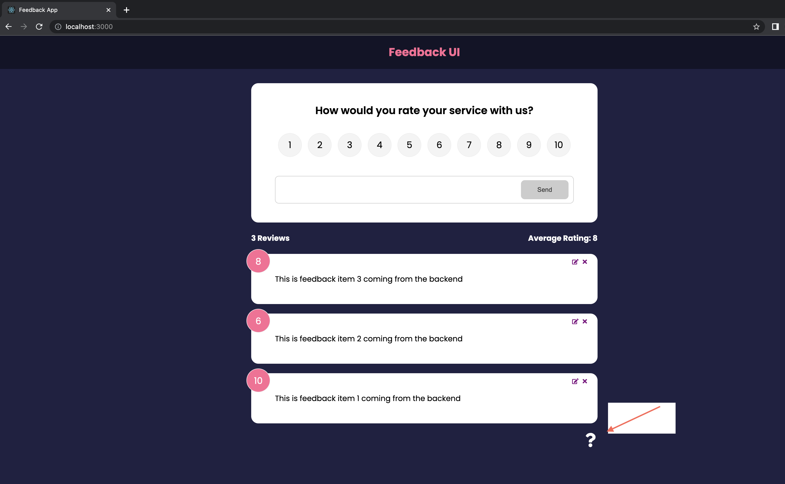
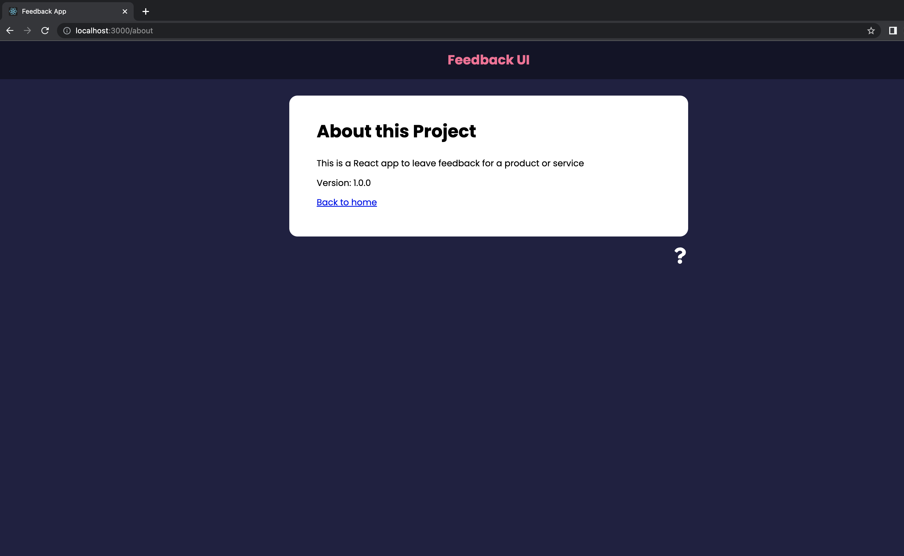
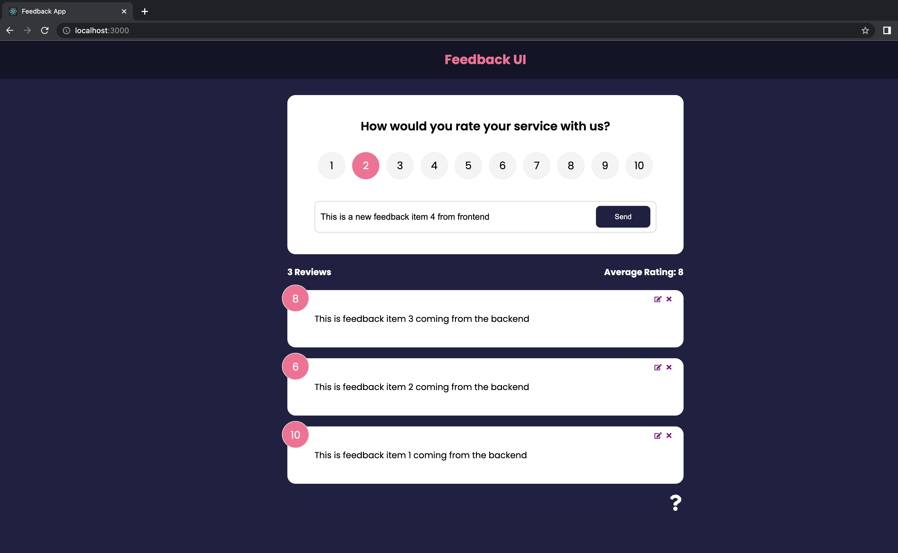
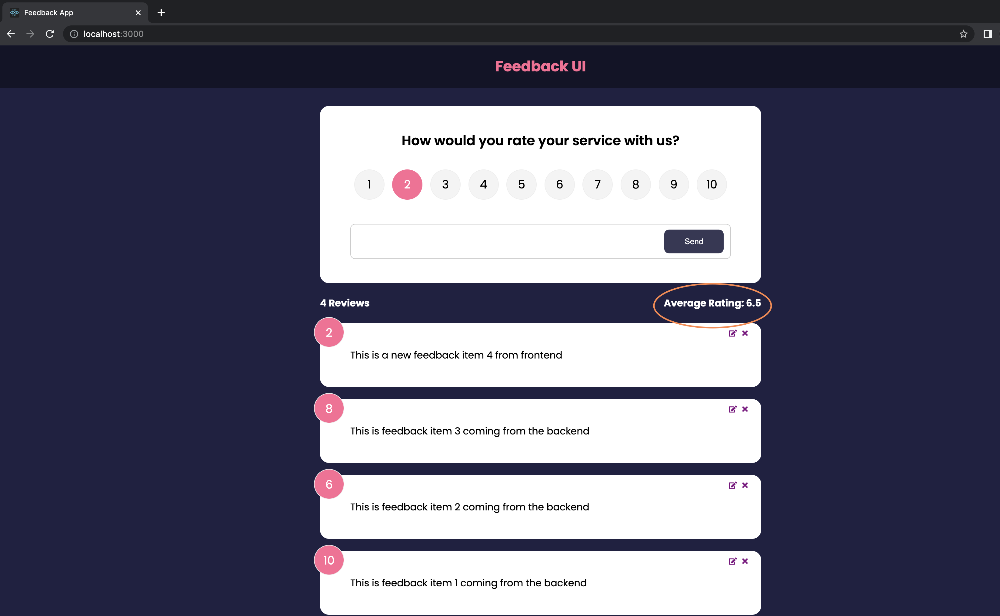
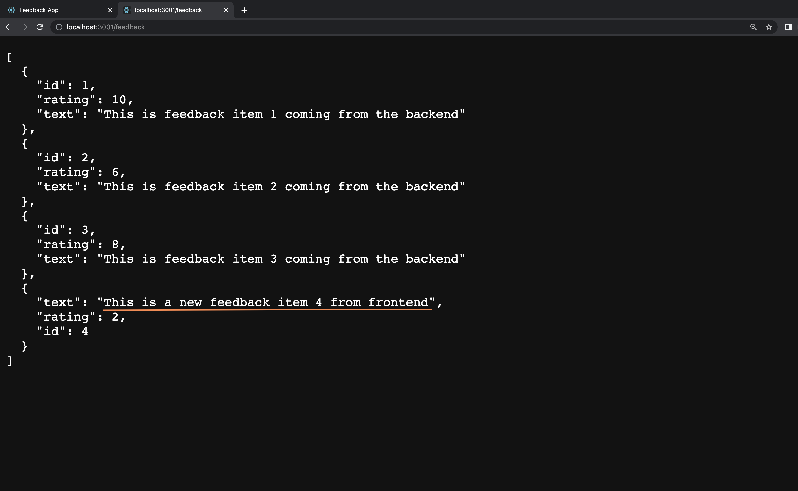
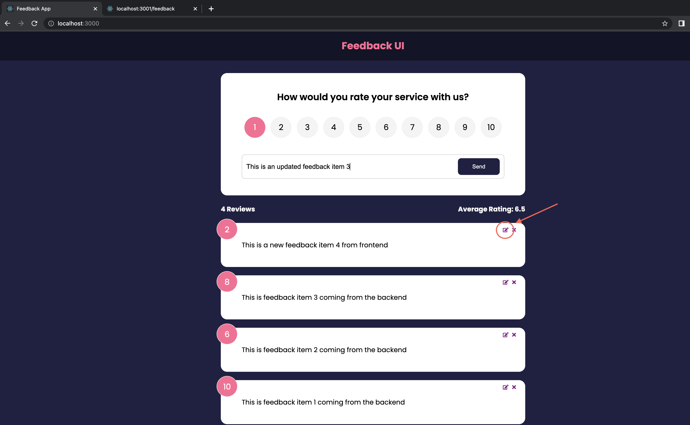
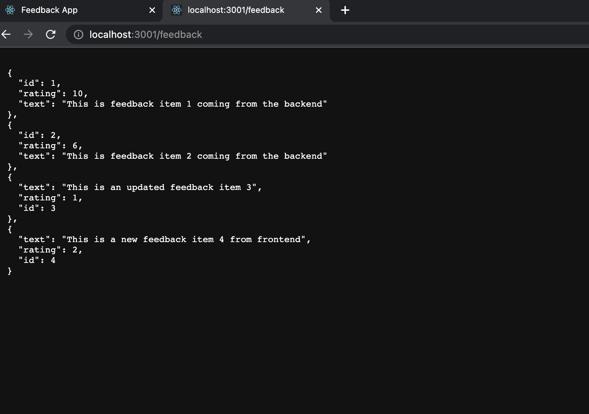
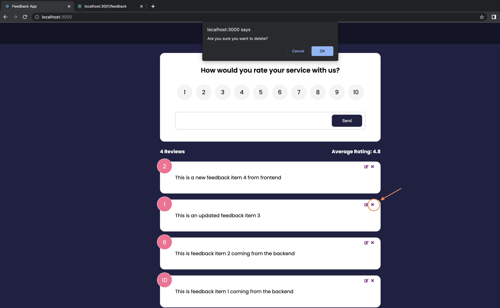
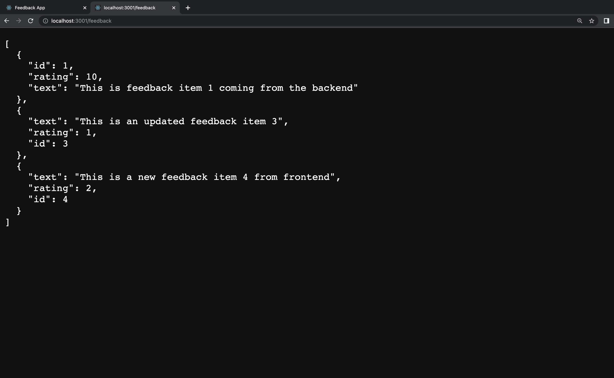
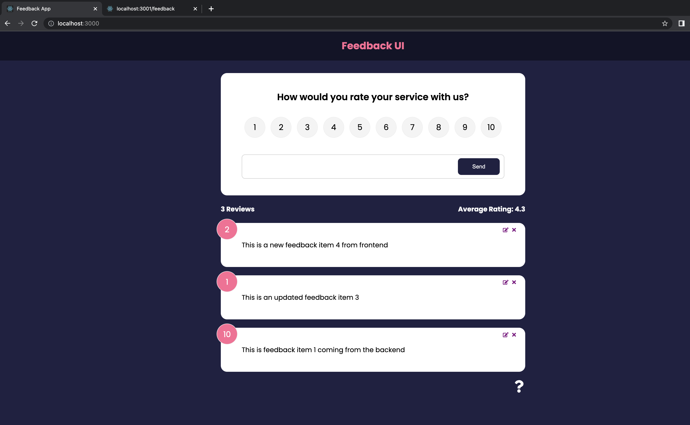

# Overview of the Feedback app

This React app allows users to add, update and delete feedback. It uses a mock REST api with json-server.

This project was bootstrapped with [Create React App](https://github.com/facebook/create-react-app).

## Preview of app

### Home Page

Below is how the project will look like once you do `npm start` and `npm run server`. You must have installed json-server with `npm install -g json-server`

The site can be accessed at http://localhost:3000/.

The question mark symbol at the bottom will bring you to the about page at http://localhost:3000/about/

### About Page

### Add new feedback

As you can see, the average rating changes with the new feedback item

The json server also contains the new feedback that was just created

### Update existing feedback

The highlighted button can be clicked to edit an existing feedback

The json server is updated with the edited feedback 

### Delete existing feedback

The highlighted button can be clicked to delete an existing feedback. A system prompt will appear to confirm your deletion.

The json server is updated without the deleted feedback 

